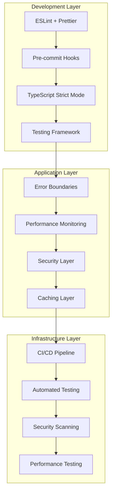

# Design Document

## Overview

This design transforms ShastraLab into an industry-grade application by implementing comprehensive testing infrastructure, strict TypeScript configuration, advanced error handling, performance optimization, security measures, and professional development workflows. The design focuses on demonstrating enterprise-level software engineering practices that will significantly enhance the project's value for campus placement interviews.

## Architecture

### Current Architecture Analysis
- **Frontend**: React 18 + TypeScript + Vite + Tailwind CSS
- **Backend**: Supabase (Database + Auth + Edge Functions)
- **State Management**: TanStack Query for server state
- **Routing**: React Router v6

### Enhanced Architecture


## Components and Interfaces

### 1. Testing Infrastructure

#### Test Configuration
```typescript
// vitest.config.ts
interface TestConfig {
  environment: 'jsdom' | 'node';
  coverage: {
    provider: 'v8';
    reporter: ['text', 'json', 'html'];
    threshold: {
      global: {
        branches: 80;
        functions: 80;
        lines: 80;
        statements: 80;
      };
    };
  };
  setupFiles: string[];
}
```

#### Test Utilities
```typescript
// src/test-utils/index.ts
interface TestWrapper {
  renderWithProviders: (component: ReactElement) => RenderResult;
  createMockUser: () => MockUser;
  mockSupabaseClient: () => MockSupabaseClient;
}

interface MockApiResponse<T> {
  data: T;
  error: null | Error;
  status: number;
}
```

### 2. TypeScript Strict Configuration

#### Enhanced Type Definitions
```typescript
// src/types/api.ts
interface ApiResponse<T> {
  data: T | null;
  error: ApiError | null;
  status: 'loading' | 'success' | 'error';
}

interface ApiError {
  code: string;
  message: string;
  details?: Record<string, unknown>;
}

// Discriminated unions for complex state
type EvaluationState = 
  | { status: 'idle' }
  | { status: 'evaluating'; progress: number }
  | { status: 'completed'; result: EvaluationResult }
  | { status: 'error'; error: ApiError };
```

#### Type Guards and Validators
```typescript
// src/utils/type-guards.ts
interface TypeGuard<T> {
  (value: unknown): value is T;
}

interface RuntimeValidator<T> {
  validate: (data: unknown) => T;
  schema: ZodSchema<T>;
}
```

### 3. Error Handling System

#### Error Boundary Component
```typescript
// src/components/ErrorBoundary.tsx
interface ErrorBoundaryState {
  hasError: boolean;
  error: Error | null;
  errorInfo: ErrorInfo | null;
}

interface ErrorBoundaryProps {
  fallback?: ComponentType<ErrorFallbackProps>;
  onError?: (error: Error, errorInfo: ErrorInfo) => void;
  children: ReactNode;
}
```

#### Error Monitoring Service
```typescript
// src/services/error-monitoring.ts
interface ErrorMonitor {
  captureException: (error: Error, context?: ErrorContext) => void;
  captureMessage: (message: string, level: LogLevel) => void;
  setUser: (user: User) => void;
  addBreadcrumb: (breadcrumb: Breadcrumb) => void;
}

interface ErrorContext {
  tags?: Record<string, string>;
  extra?: Record<string, unknown>;
  level?: LogLevel;
}
```

### 4. Performance Monitoring

#### Performance Metrics Collector
```typescript
// src/services/performance.ts
interface PerformanceMetrics {
  pageLoadTime: number;
  apiResponseTime: number;
  renderTime: number;
  memoryUsage: number;
  bundleSize: number;
}

interface PerformanceMonitor {
  startTransaction: (name: string) => Transaction;
  measureApiCall: <T>(promise: Promise<T>) => Promise<T>;
  trackUserInteraction: (event: UserInteractionEvent) => void;
}
```

#### Caching Strategy
```typescript
// src/services/cache.ts
interface CacheConfig {
  ttl: number; // Time to live in milliseconds
  maxSize: number; // Maximum cache size
  strategy: 'lru' | 'fifo' | 'lfu';
}

interface CacheService<T> {
  get: (key: string) => T | null;
  set: (key: string, value: T, ttl?: number) => void;
  invalidate: (key: string) => void;
  clear: () => void;
}
```

### 5. Security Implementation

#### Input Validation
```typescript
// src/utils/validation.ts
interface ValidationRule<T> {
  validate: (value: T) => boolean;
  message: string;
}

interface InputSanitizer {
  sanitizeHtml: (input: string) => string;
  sanitizeFileName: (input: string) => string;
  validateEmail: (email: string) => boolean;
  validatePassword: (password: string) => ValidationResult;
}
```

#### Security Headers
```typescript
// src/middleware/security.ts
interface SecurityConfig {
  csp: ContentSecurityPolicy;
  rateLimit: RateLimitConfig;
  cors: CorsConfig;
}

interface ContentSecurityPolicy {
  defaultSrc: string[];
  scriptSrc: string[];
  styleSrc: string[];
  imgSrc: string[];
}
```

## Data Models

### Enhanced User Profile
```typescript
interface UserProfile {
  id: string;
  email: string;
  fullName: string;
  institutionName?: string;
  preferences: UserPreferences;
  securitySettings: SecuritySettings;
  createdAt: Date;
  updatedAt: Date;
}

interface UserPreferences {
  theme: 'light' | 'dark' | 'system';
  notifications: NotificationSettings;
  privacy: PrivacySettings;
}
```

### Performance Metrics Model
```typescript
interface PerformanceLog {
  id: string;
  userId: string;
  sessionId: string;
  metrics: PerformanceMetrics;
  timestamp: Date;
  userAgent: string;
  url: string;
}
```

### Error Log Model
```typescript
interface ErrorLog {
  id: string;
  userId?: string;
  sessionId: string;
  error: SerializedError;
  context: ErrorContext;
  timestamp: Date;
  resolved: boolean;
}
```

## Correctness Properties

*A property is a characteristic or behavior that should hold true across all valid executions of a system-essentially, a formal statement about what the system should do. Properties serve as the bridge between human-readable specifications and machine-verifiable correctness guarantees.*

### Testing Infrastructure Properties

**Property 1: Comprehensive Test Coverage**
*For any* utility function or custom hook in the codebase, there should exist corresponding test files that execute successfully and provide meaningful assertions
**Validates: Requirements 1.1**

**Property 2: API Integration Testing**
*For any* API endpoint, there should exist integration tests that verify the endpoint works correctly with actual database operations
**Validates: Requirements 1.2**

**Property 3: Component Test Completeness**
*For any* React component, there should exist React Testing Library tests that render the component and verify its behavior
**Validates: Requirements 1.3**

**Property 4: E2E Test Coverage**
*For any* critical user journey, there should exist Playwright E2E tests that verify the complete workflow functions correctly
**Validates: Requirements 1.4**

**Property 5: Code Coverage Threshold**
*For any* test execution, the code coverage percentage should be at least 80% across lines, branches, functions, and statements
**Validates: Requirements 1.5**

**Property 6: Property-Based Algorithm Testing**
*For any* answer evaluation algorithm, there should exist property-based tests that verify correctness across generated inputs
**Validates: Requirements 1.6**

**Property 7: Coverage Report Generation**
*For any* test execution, detailed coverage reports should be generated in HTML, JSON, and text formats
**Validates: Requirements 1.7**

**Property 8: Performance Test Validation**
*For any* API endpoint under load testing, response times should be measured and validated against performance thresholds
**Validates: Requirements 1.8**

### Type Safety Properties

**Property 9: Strict TypeScript Compilation**
*For any* TypeScript compilation, there should be zero implicit any types and zero compilation errors
**Validates: Requirements 2.1, 2.6**

**Property 10: API Response Type Safety**
*For any* API response, there should exist comprehensive type definitions that are used consistently throughout the application
**Validates: Requirements 2.2**

**Property 11: Null Safety Enforcement**
*For any* code that handles potentially null or undefined values, strict null checks should prevent runtime null reference errors
**Validates: Requirements 2.3**

**Property 12: Generic Type Usage**
*For any* reusable component, appropriate generic types should be used to maintain type safety while allowing flexibility
**Validates: Requirements 2.4**

**Property 13: Discriminated Union Type Safety**
*For any* complex state management, discriminated unions should provide type safety and enable proper type narrowing
**Validates: Requirements 2.5**

**Property 14: Runtime Type Validation**
*For any* critical data validation, custom type guards should correctly validate types at runtime
**Validates: Requirements 2.7**

### Error Handling Properties

**Property 15: Error Boundary Protection**
*For any* React component error, error boundaries should catch the error and display appropriate fallback UI without crashing the application
**Validates: Requirements 3.1, 3.7**

**Property 16: User-Friendly Error Experience**
*For any* error that occurs, users should see friendly error messages with clear recovery options
**Validates: Requirements 3.2**

**Property 17: Error Logging Completeness**
*For any* error that occurs, detailed error information should be logged to the monitoring system for debugging purposes
**Validates: Requirements 3.3**

**Property 18: Performance Metrics Tracking**
*For any* user interaction or system operation, relevant performance metrics should be tracked and updated in real-time
**Validates: Requirements 3.4, 3.5, 3.6**

**Property 19: Performance Alert Generation**
*For any* performance metric that exceeds defined thresholds, appropriate alerts should be generated for monitoring
**Validates: Requirements 3.8**

### Code Quality Properties

**Property 20: Consistent Code Formatting**
*For any* code file, Prettier should format it consistently according to the project's configuration
**Validates: Requirements 4.1, 4.7**

**Property 21: Coding Standards Enforcement**
*For any* code that violates ESLint rules, the linting process should catch and report the violations
**Validates: Requirements 4.2**

**Property 22: Pre-commit Quality Gates**
*For any* commit attempt with code quality violations, pre-commit hooks should prevent the commit from succeeding
**Validates: Requirements 4.3**

**Property 23: Import Organization**
*For any* code file with imports, the tools should enforce consistent import ordering and remove unused imports
**Validates: Requirements 4.5**

**Property 24: Accessibility Standards**
*For any* UI component, accessibility linting should catch violations of inclusive design principles
**Validates: Requirements 4.6**

### Performance Properties

**Property 25: Code Splitting Effectiveness**
*For any* route in the application, code should be split appropriately to enable lazy loading and reduce initial bundle size
**Validates: Requirements 5.1**

**Property 26: Bundle Size Optimization**
*For any* production build, the initial bundle size should be under 500KB
**Validates: Requirements 5.2**

**Property 27: Virtual Scrolling Performance**
*For any* large data list, only visible items should be rendered in the DOM to maintain performance
**Validates: Requirements 5.3**

**Property 28: API Response Caching**
*For any* identical API request made within the cache TTL period, the cached response should be used instead of making a new network call
**Validates: Requirements 5.4**

**Property 29: Offline Functionality**
*For any* cached content, it should remain accessible when the application is offline through service worker implementation
**Validates: Requirements 5.5**

**Property 30: Lighthouse Performance Standards**
*For any* page load, Lighthouse performance scores should be above 90 for performance, accessibility, best practices, and SEO
**Validates: Requirements 5.7**

### Security Properties

**Property 31: Input Validation and Sanitization**
*For any* user input, it should be validated and sanitized before processing to prevent injection attacks
**Validates: Requirements 6.1, 6.7**

**Property 32: Rate Limiting Protection**
*For any* API endpoint, rate limiting should prevent abuse by limiting requests per user per time period
**Validates: Requirements 6.2**

**Property 33: CSRF Protection**
*For any* state-changing operation, CSRF tokens should be validated to prevent cross-site request forgery attacks
**Validates: Requirements 6.3**

**Property 34: Security Headers Implementation**
*For any* HTTP response, appropriate security headers including CSP should be present and properly configured
**Validates: Requirements 6.4**

**Property 35: Audit Logging Completeness**
*For any* sensitive operation, detailed audit logs should be created with user, timestamp, and operation details
**Validates: Requirements 6.5**

**Property 36: Data Encryption Standards**
*For any* sensitive data, it should be encrypted in transit using HTTPS and at rest using appropriate encryption methods
**Validates: Requirements 6.6**

### CI/CD Properties

**Property 37: Automated Test Execution**
*For any* pull request, all tests should run automatically and results should be reported
**Validates: Requirements 7.1**

**Property 38: Automated Deployment Pipeline**
*For any* main branch update, deployment to staging should occur automatically without manual intervention
**Validates: Requirements 7.2**

**Property 39: Security Scanning Integration**
*For any* pipeline execution, automated security scanning and dependency checks should be performed and results reported
**Validates: Requirements 7.3**

**Property 40: Coverage Report Publishing**
*For any* test execution in CI/CD, coverage reports should be generated and published to accessible locations
**Validates: Requirements 7.4**

**Property 41: Performance Regression Detection**
*For any* deployment, performance regression tests should detect and report performance degradations
**Validates: Requirements 7.5**

**Property 42: Zero-Downtime Deployment**
*For any* production deployment, blue-green deployment strategy should ensure zero downtime during updates
**Validates: Requirements 7.6**

**Property 43: Build Status Feedback**
*For any* code push, immediate feedback on build status should be provided to developers
**Validates: Requirements 7.7**

### Documentation Properties

**Property 44: API Documentation Completeness**
*For any* API endpoint, there should exist accurate and complete OpenAPI/Swagger specifications
**Validates: Requirements 8.1, 8.7**

**Property 45: Component Documentation Coverage**
*For any* reusable component, there should exist Storybook stories that demonstrate its usage and variations
**Validates: Requirements 8.2**

## Error Handling

### Error Boundary Strategy
- **Component-Level Boundaries**: Each major feature area has its own error boundary
- **Global Boundary**: Top-level error boundary catches any unhandled errors
- **Error Recovery**: Provide retry mechanisms and graceful degradation
- **Error Reporting**: Integrate with monitoring services for error tracking

### Performance Monitoring Strategy
- **Real-Time Metrics**: Track performance metrics during user interactions
- **Threshold Alerts**: Set up alerts for performance degradation
- **User Experience Tracking**: Monitor Core Web Vitals and user satisfaction metrics
- **Resource Monitoring**: Track memory usage, bundle sizes, and network performance

## Testing Strategy

### Dual Testing Approach
The testing strategy employs both unit testing and property-based testing as complementary approaches:

- **Unit Tests**: Verify specific examples, edge cases, and error conditions
- **Property Tests**: Verify universal properties across all inputs
- **Integration Tests**: Verify component interactions and API integrations
- **E2E Tests**: Verify complete user workflows and system behavior

### Testing Framework Configuration
- **Framework**: Vitest for unit and integration tests, Playwright for E2E tests
- **Property Testing**: Fast-check library for property-based testing
- **Coverage**: Minimum 80% coverage across lines, branches, functions, and statements
- **Test Execution**: Minimum 100 iterations per property test
- **Tagging**: Each property test tagged with **Feature: industry-grade-improvements, Property {number}: {property_text}**

### Test Organization
- **Unit Tests**: Co-located with source files using `.test.ts` suffix
- **Integration Tests**: Separate `__tests__/integration` directory
- **E2E Tests**: Separate `e2e` directory with page object models
- **Test Utilities**: Shared test utilities and mocks in `src/test-utils`

The comprehensive testing approach ensures code reliability, demonstrates professional testing practices, and provides confidence for production deployment.