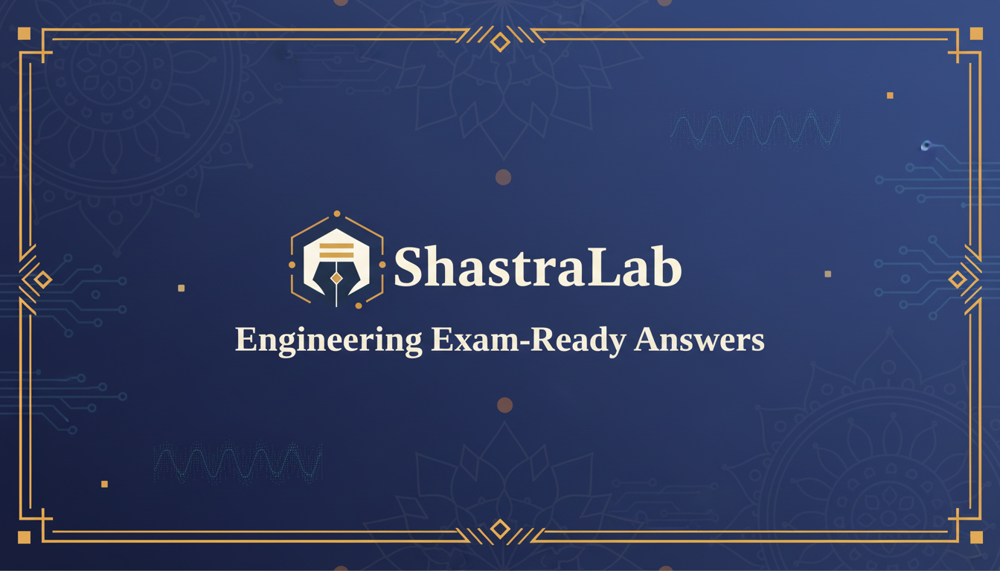

# ShastraLab

**Engineering Exam-Ready Answers** — An AI-powered answer evaluation platform inspired by the ancient Indian Shastra tradition.



## 🎯 Overview

ShastraLab helps UPSC and civil services aspirants write examiner-ready answers through structured feedback and visual mentoring. The platform evaluates handwritten and typed answers using a Shastra-inspired framework — analyzing structure, relevance, depth, and examiner expectations.

## ✨ Key Features

### 📝 Answer Evaluation
- **Handwritten Answer Support** — Upload photos of handwritten answers with 98% OCR accuracy
- **AI-Powered Analysis** — Get detailed feedback on structure, content, and presentation
- **Paragraph-by-Paragraph Breakdown** — Understand strengths and improvements for each section
- **Model Answer Comparison** — Compare your response with ideal answers side-by-side

### 📚 Question Bank & Analysis
- **PYQ Database** — Access previous year questions from UPSC Mains
- **Topic Classification** — Questions auto-categorized by topic and difficulty
- **Syllabus Mapping** — Link questions to official syllabus topics
- **Year-over-Year Trends** — Analyze topic frequency across exam years

### 🎓 Practice Modes
- **Written Practice** — Practice individual questions with instant evaluation
- **Timed Mock Tests** — Simulate exam conditions with countdown timer
- **Batch Analysis** — Upload multiple PDFs for bulk question extraction

### 📊 Progress Tracking
- **Daily Streak System** — Build consistency with streak tracking and freeze protection
- **Achievement Badges** — Unlock milestones as you progress
- **Leaderboard** — Compare performance with other aspirants
- **Submission History** — Review all past evaluations and track improvement

### 🔊 Feedback Modes
- **Text Feedback** — Detailed written analysis of your answer
- **Audio Feedback** — Listen to AI-generated audio summaries
- **Video Mentoring** — Watch AI-generated video explanations

## 🏗️ App Flow

```
┌─────────────────────────────────────────────────────────────────┐
│                        LANDING PAGE                              │
│                    (Unauthenticated Users)                       │
│                                                                  │
│  • Platform overview                                             │
│  • Sign In / Get Started buttons                                 │
└──────────────────────────┬──────────────────────────────────────┘
                           │
                           ▼
┌─────────────────────────────────────────────────────────────────┐
│                      AUTHENTICATION                              │
│                                                                  │
│  • Email/Password Sign Up                                        │
│  • Email/Password Sign In                                        │
└──────────────────────────┬──────────────────────────────────────┘
                           │
                           ▼
┌─────────────────────────────────────────────────────────────────┐
│                        DASHBOARD                                 │
│                                                                  │
│  • Overview stats (papers, questions, syllabi analyzed)          │
│  • Difficulty distribution chart                                 │
│  • Top topics visualization                                      │
│  • Current streak display                                        │
│  • Quick action buttons                                          │
└──────────────────────────┬──────────────────────────────────────┘
                           │
           ┌───────────────┼───────────────┐
           ▼               ▼               ▼
┌──────────────────┐ ┌──────────────────┐ ┌──────────────────┐
│   SYLLABI        │ │  QUESTION BANK   │ │  WRITTEN         │
│                  │ │                  │ │  PRACTICE        │
│ • Create/manage  │ │ • Search/filter  │ │                  │
│   syllabi        │ │ • Export data    │ │ • Select question│
│ • Define topics  │ │ • View analysis  │ │ • Write/upload   │
│ • Link to exams  │ │                  │ │   answer         │
└──────────────────┘ └──────────────────┘ │ • Get evaluation │
                                          └────────┬─────────┘
                                                   │
                                                   ▼
                                          ┌──────────────────┐
                                          │   EVALUATION     │
                                          │   RESULTS        │
                                          │                  │
                                          │ • Score & grade  │
                                          │ • Strengths      │
                                          │ • Improvements   │
                                          │ • Paragraph      │
                                          │   analysis       │
                                          │ • Model answer   │
                                          │   comparison     │
                                          │ • Audio/Video    │
                                          │   feedback       │
                                          └──────────────────┘

┌─────────────────────────────────────────────────────────────────┐
│                     OTHER FEATURES                               │
├──────────────────┬──────────────────┬───────────────────────────┤
│  ANALYZE PAPER   │  BATCH ANALYZE   │  COMPARE PAPERS           │
│                  │                  │                           │
│  Upload single   │  Upload multiple │  Side-by-side paper       │
│  PDF, extract    │  PDFs for bulk   │  comparison               │
│  questions       │  processing      │                           │
├──────────────────┼──────────────────┼───────────────────────────┤
│  YEAR TRENDS     │  MOCK TEST       │  LEADERBOARD              │
│                  │                  │                           │
│  Topic frequency │  Timed practice  │  Compare scores           │
│  across years    │  with countdown  │  with peers               │
├──────────────────┼──────────────────┼───────────────────────────┤
│  ACHIEVEMENTS    │  SUBMISSION      │  REPORTS                  │
│                  │  HISTORY         │                           │
│  Unlock badges   │  Review past     │  Performance              │
│  and milestones  │  evaluations     │  analytics                │
└──────────────────┴──────────────────┴───────────────────────────┘
```

## 🛠️ Tech Stack

- **Frontend**: React 18, TypeScript, Vite
- **Styling**: Tailwind CSS, shadcn/ui
- **State Management**: TanStack Query (React Query)
- **Routing**: React Router v6
- **Backend**: Supabase (Database, Auth, Edge Functions, Storage)
- **AI Integration**: Lovable AI Gateway
- **Charts**: Recharts
- **Animations**: Framer Motion

## 📁 Project Structure

```
src/
├── components/
│   ├── layouts/          # App layout with sidebar navigation
│   ├── ui/               # shadcn/ui components
│   ├── AchievementBadge.tsx
│   ├── FeedbackVideo.tsx
│   ├── MockTestTimer.tsx
│   ├── PdfUploader.tsx
│   ├── PracticeCalendar.tsx
│   ├── QuestionNavigation.tsx
│   ├── ShastraLabLogo.tsx
│   ├── StreakDisplay.tsx
│   ├── StreakFreeze.tsx
│   ├── SubjectAnalytics.tsx
│   └── ThemeToggle.tsx
├── hooks/
│   ├── useAuth.tsx       # Authentication context
│   ├── useStreak.ts      # Streak tracking
│   ├── useAchievements.ts
│   ├── useNotifications.ts
│   ├── useTTS.ts         # Text-to-speech
│   └── useCountdownTimer.ts
├── pages/
│   ├── Index.tsx         # Landing page
│   ├── Auth.tsx          # Sign in/up
│   ├── Dashboard.tsx     # User dashboard
│   ├── Syllabi.tsx       # Syllabus management
│   ├── Analyze.tsx       # Single paper analysis
│   ├── BatchAnalyze.tsx  # Bulk PDF processing
│   ├── PaperComparison.tsx
│   ├── YearOverYear.tsx  # Topic trends
│   ├── WrittenPractice.tsx  # Main practice feature
│   ├── MockTest.tsx      # Timed tests
│   ├── Leaderboard.tsx
│   ├── Achievements.tsx
│   ├── Questions.tsx     # Question bank
│   ├── Reports.tsx
│   └── SubmissionHistory.tsx
├── integrations/
│   └── supabase/         # Supabase client & types
└── lib/
    └── utils.ts          # Utility functions

supabase/
└── functions/
    ├── analyze-question/     # Topic/difficulty classification
    ├── evaluate-answer/      # AI answer evaluation
    ├── extract-questions/    # Question extraction from text
    ├── generate-video-feedback/
    ├── ocr-handwriting/      # Handwriting recognition
    ├── ocr-pdf/              # PDF text extraction
    ├── send-progress-report/
    └── tts-feedback/         # Audio feedback generation
```

## 🗄️ Database Schema

| Table | Purpose |
|-------|---------|
| `profiles` | User profile information |
| `syllabi` | Syllabus definitions with topics |
| `exam_papers` | Uploaded exam papers |
| `questions` | Extracted and analyzed questions |
| `practice_questions` | User-created practice questions |
| `mock_tests` | Mock test templates |
| `answer_submissions` | User answer submissions with evaluations |
| `daily_practice_streaks` | Streak tracking data |
| `achievements` | Unlocked user achievements |
| `email_report_preferences` | Email notification settings |
| `user_roles` | Role-based access control |

## 🚀 Getting Started

### Prerequisites

- Node.js 18+ 
- npm or bun

### Installation

```bash
# Clone the repository
git clone <YOUR_GIT_URL>

# Navigate to project directory
cd shastralab

# Install dependencies
npm install

# Start development server
npm run dev
```

### Environment Variables

The project uses Lovable Cloud (Supabase) which automatically provides:
- `VITE_SUPABASE_URL`
- `VITE_SUPABASE_PUBLISHABLE_KEY`
- `VITE_SUPABASE_PROJECT_ID`

## 📱 Pages & Routes

| Route | Page | Description |
|-------|------|-------------|
| `/` | Landing | Public landing page |
| `/auth` | Authentication | Sign in / Sign up |
| `/dashboard` | Dashboard | User overview & stats |
| `/syllabi` | Syllabi | Manage syllabi & topics |
| `/analyze` | Analyze Paper | Single PDF analysis |
| `/batch-analyze` | Batch Analyze | Multiple PDF processing |
| `/compare` | Compare Papers | Side-by-side comparison |
| `/year-over-year` | Year Trends | Topic frequency analysis |
| `/written-practice` | Written Practice | Practice answer writing |
| `/mock-test` | Mock Test | Timed exam simulation |
| `/leaderboard` | Leaderboard | User rankings |
| `/achievements` | Achievements | Badge collection |
| `/questions` | Question Bank | Search & filter questions |
| `/reports` | Reports | Performance analytics |
| `/submission-history` | My Progress | Past submission review |

## 🎨 Theming

The app supports light and dark modes with a custom design system:
- Primary: Deep indigo/blue tones
- Accent: Saffron/orange (inspired by Indian tradition)
- Typography: Display font for headings, clean sans-serif for body

## 📄 License

© 2025 ShastraLab. All rights reserved.

---

Built with ❤️ using [Lovable](https://lovable.dev)
